# AiXWorkforce360 Workforce User Manual

## Document Information

| Field | Details |
|---|---|
| Product | AiXWorkforce360 |
| Document Type | End User Manual |
| Module Scope | Workforce Operations |
| Intended Users | Admin, HR Persona, Manager, Employee |
| Environment | Current Application |
| Data Privacy | Screenshots use sample data. Sensitive values such as OTP, tenant code, phone number, email, URL, IDs, and personal identifiers are masked where visible. |

---

## Navigation

- [1. Introduction](#1-introduction)
- [2. User Roles and Access](#2-user-roles-and-access)
- [3. Login and OTP Verification](#3-login-and-otp-verification)
- [4. Workforce Operations Dashboard](#4-workforce-operations-dashboard)
- [5. Employee Module](#5-employee-module)
- [6. Policies & Compliance Module](#6-policies--compliance-module)
- [7. Case Repository / Case Configuration](#7-case-repository--case-configuration)
- [8. Case Management Module](#8-case-management-module)
- [9. Onboarding & Docs Module](#9-onboarding--docs-module)
- [10. Permission-Based Visibility](#10-permission-based-visibility)
- [11. Common User Tips](#11-common-user-tips)

---

## 1. Introduction

AiXWorkforce360 is a workforce operations platform that helps users manage employees, cases, policies, compliance workflows, onboarding documents, and role-based activities from a single interface.

This user manual explains the current application flow from an end-user perspective. It shows how users can log in, navigate the system, view records, create employees, create cases, manage policies, configure case templates, and review case workflow progress.

---

## 2. User Roles and Access

AiXWorkforce360 displays modules and actions based on the user’s assigned role and permissions.

| User Type | Typical Access |
|---|---|
| Admin / Tenant Admin | Can manage employees, cases, onboarding, policies, case templates, and role-based activities based on permission. |
| HR Persona / HR Manager | Can perform HR operations such as employee management, case management, policy review, onboarding review, and related actions where permission is available. |
| Employee | Can view assigned information, create cases, upload onboarding documents, and view accessible case or employee details where permission is available. |

> If a button or module is not visible, the user may not have permission for that action.

---

## 3. Login and OTP Verification

### Purpose

The login flow allows users to access AiXWorkforce360 using a tenant code, country code, phone number, and OTP verification.

### Steps to Log In

1. Open the AiXWorkforce360 application.
2. Enter the **Tenant Code**.
3. Select the country code.
4. Enter the registered phone number.
5. Select **Remember Me** if required.
6. Click **Sign In**.
7. Enter the OTP received on the registered phone number.
8. Click **Verify & Login**.
9. The application opens the dashboard based on the user’s role and permissions.

### Login Page

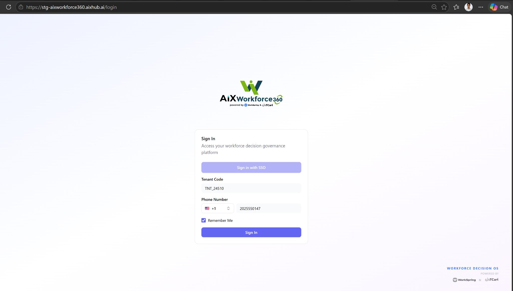

### OTP Verification Page

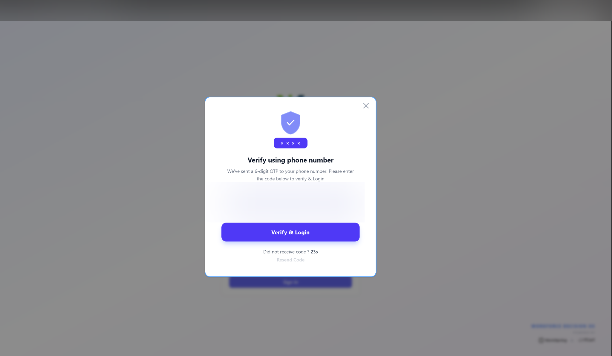

---

## 4. Workforce Operations Dashboard

### Purpose

The dashboard provides a quick view of workforce activity, pending approvals, active cases, onboarding pipeline, and operational trends.

### What Users Can See

| Dashboard Area | Description |
|---|---|
| People Overview | Total people count visible to the user. |
| Active Cases | Current active case count. |
| Pending Approvals | Items waiting for review or approval. |
| Onboarding Pipeline | Active onboarding count. |
| Case Resolution Trend | Visual trend of opened and resolved cases. |
| Case Management Snapshot | Quick view of case categories and counts. |

### User Actions

1. Log in to the platform.
2. Review the summary cards on the dashboard.
3. Use the left navigation menu to open modules.
4. Click **Open Case Management** or **Create Case** where available.
5. Use global search to search employees, cases, policies, or decisions.

### Screenshot

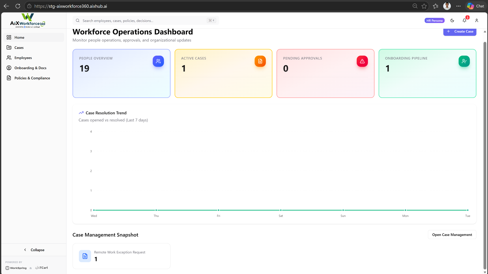

---

## 5. Employee Module

### Purpose

The Employee module allows authorized users to view employee records, search employees, create new employees, view employee profiles, contact employees, edit employee records, and create cases for employees.

---

### 5.1 Open Employee Directory

### Steps

1. Click **Employees** from the left navigation menu.
2. The **Employee Directory** page opens.
3. Review summary cards such as total employees, joined this month, department count, and other classifications.
4. Use the employee table to view employee name, role, email, region, manager, hire date, status, and actions.

### Screenshot

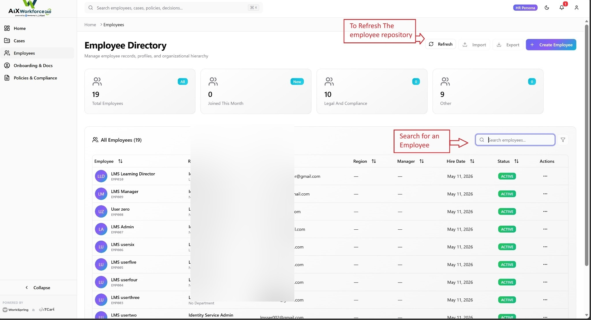

---

### 5.2 Search or Refresh Employee Records

### Steps

1. Open the **Employees** page.
2. Use the **Search employees** field to search for a specific employee.
3. Use the filter icon if available.
4. Click **Refresh** to reload the employee repository.
5. Use pagination to move between employee pages.

### Screenshot

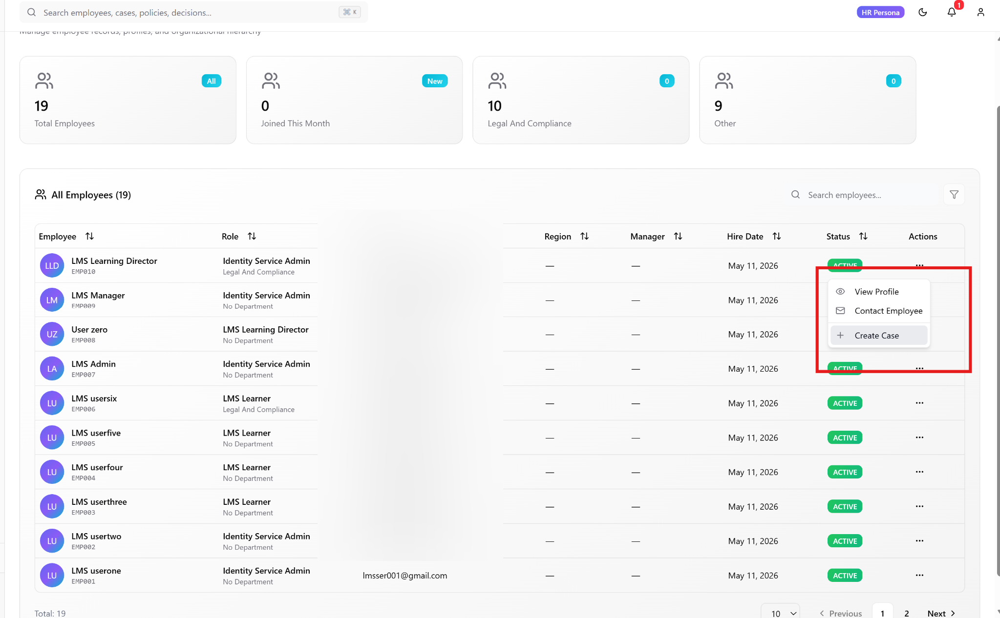

---

### 5.3 Employee Row Actions

Each employee row has an action menu.

### Available Actions

| Action | Description |
|---|---|
| View Profile | Opens the employee profile page. |
| Contact Employee | Opens contact details such as email and phone. |
| Create Case | Starts case creation for that employee. |

### Steps

1. Go to **Employees**.
2. Find the required employee.
3. Click the three-dot action menu.
4. Select the required action.

### Screenshot

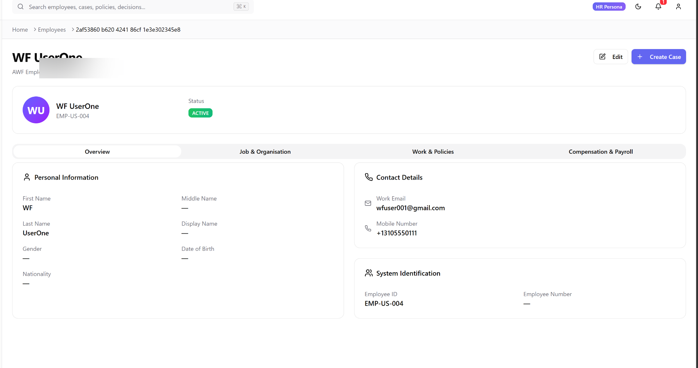

---

### 5.4 Contact Employee

### Steps

1. Open the employee action menu.
2. Click **Contact Employee**.
3. View available contact options.
4. Use **Send Email** to contact the employee by email.
5. Use **Call Employee** to call the employee.
6. Click **Close** after reviewing the details.

### Screenshot

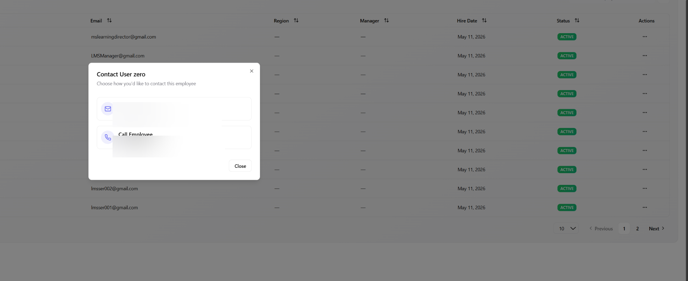

---

### 5.5 View Employee Profile

### Steps

1. Go to **Employees**.
2. Click the employee action menu.
3. Select **View Profile**.
4. The employee profile page opens.
5. Review the employee’s status, profile details, and available tabs.

### Employee Profile Tabs

| Tab | Purpose |
|---|---|
| Overview | Shows personal information, contact details, and system identification. |
| Job & Organisation | Shows employment information, department, location, and reporting structure. |
| Work & Policies | Shows onboarding settings, leave mapping, attendance, and policy-related information. |
| Compensation & Payroll | Shows payroll, salary, bonus, perks, and tax-related information. |

### Screenshot

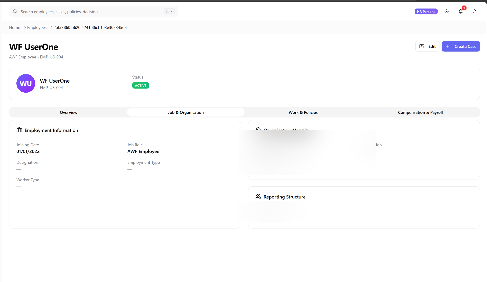

---

### 5.6 Edit Employee or Create Case from Employee Profile

### Steps to Edit Employee

1. Open the employee profile.
2. Click **Edit**.
3. Update the required information.
4. Move through the employee form steps.
5. Review and save the changes.

### Steps to Create Case for Employee

1. Open the employee profile.
2. Click **Create Case**.
3. The case creation wizard opens.
4. Complete the case details and submit.

### Screenshot

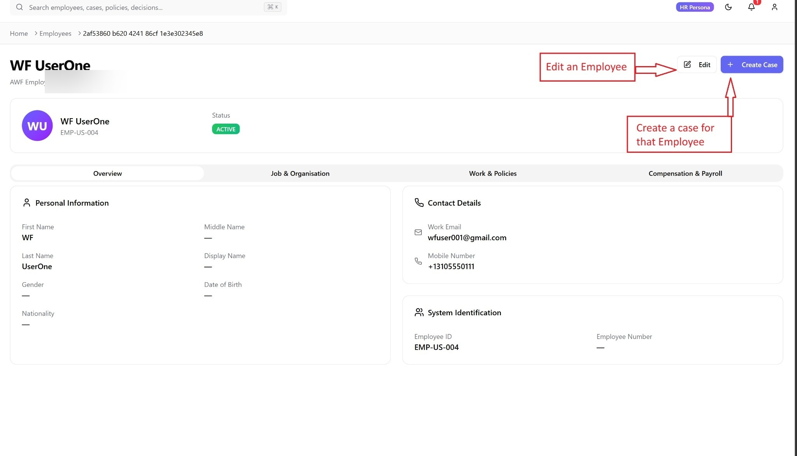

---

### 5.7 View Job & Organisation Details

### Steps

1. Open an employee profile.
2. Click the **Job & Organisation** tab.
3. Review employment information such as joining date, job role, department, location, and reporting manager.
4. Return to other tabs if needed.

### Screenshot

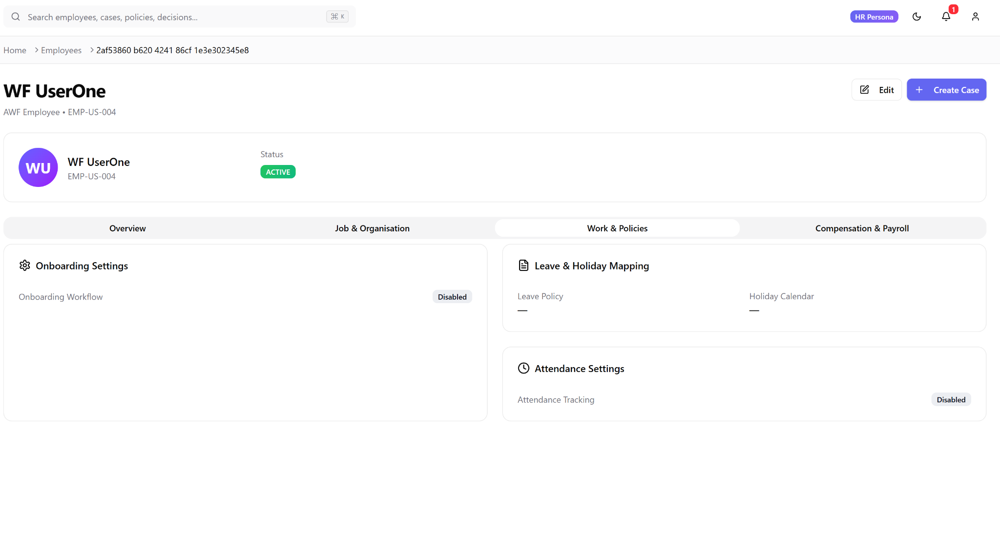

---

### 5.8 View Work & Policies Details

### Steps

1. Open an employee profile.
2. Click the **Work & Policies** tab.
3. Review onboarding workflow status, leave and holiday mapping, attendance settings, and policy mapping.
4. Check whether onboarding workflow or attendance tracking is enabled or disabled.

### Screenshot

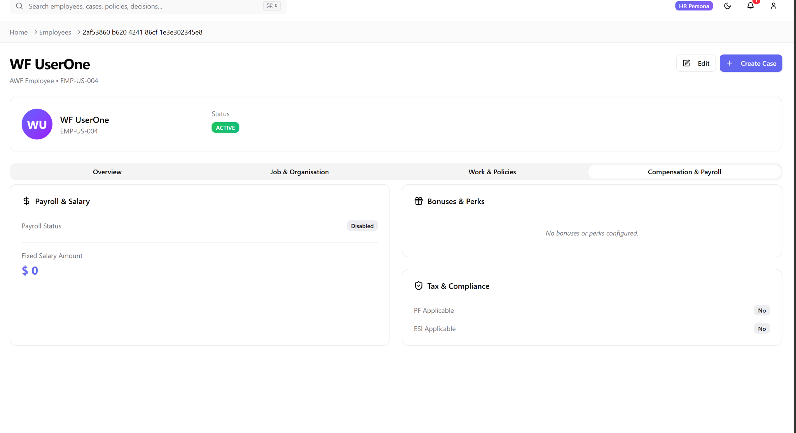

---

### 5.9 View Compensation & Payroll Details

### Steps

1. Open an employee profile.
2. Click the **Compensation & Payroll** tab.
3. Review payroll status, salary amount, bonuses, perks, and tax compliance status.
4. Check whether PF and ESI are applicable.

### Screenshot

---

### 5.10 Create New Employee

The Create New Employee flow is a five-step wizard.

| Step | Name | Purpose |
|---|---|---|
| 1 | Basic Details | Captures personal information, system identification, and contact details. |
| 2 | Job & Organisation | Captures employment details, organization mapping, role access, reporting structure, and employment terms. |
| 3 | Work & Policies | Captures onboarding, leave, attendance, and expense policy settings. |
| 4 | Compensation & Payroll | Captures payroll setup, salary structure, salary breakdown, bonus, perks, and tax compliance. |
| 5 | Review & Submit | Allows the user to review entered information and submit the employee record. |

---

### Step 1: Basic Details

### Steps

1. Go to **Employees**.
2. Click **Create Employee**.
3. In **Basic Details**, enter personal information.
4. Enter system identification details if required.
5. Enter work email and mobile number.
6. Add optional fields if needed, such as personal email, alternate mobile number, LinkedIn profile, emergency contact name, or emergency contact phone.
7. Click **Continue**.

### Fields Visible

| Field / Section | Description |
|---|---|
| Work Country | User’s work country. |
| First Name | Employee first name. |
| Middle Name | Employee middle name, if applicable. |
| Last Name | Employee last name. |
| Display Name | Display name used in the system. |
| Gender | Gender selection. |
| Date of Birth | Employee date of birth. |
| Nationality | Nationality selection. |
| Blood Group | Blood group selection. |
| Employee ID Series | Employee ID sequence. |
| Employee Number | Auto-generated or system-generated value. |
| Previous Employee ID | Previous employee ID if applicable. |
| Work Email | Official email. |
| Mobile Number | Registered mobile number. |

### Screenshot

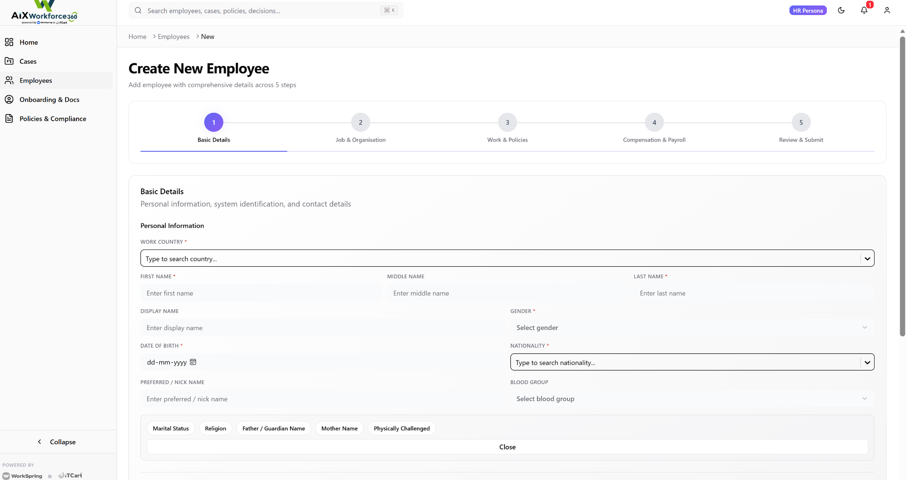

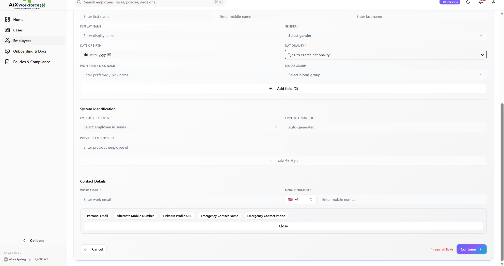

---

### Step 2: Job & Organisation

### Steps

1. Enter the employee joining date.
2. Enter job role and designation.
3. Select employment type and worker type.
4. Select legal entity, business unit, department, team, location, and region where required.
5. Select access role type.
6. Review auto-assigned apps and permissions.
7. Enter reporting manager and skip-level manager if required.
8. Select probation policy and notice period policy.
9. Click **Continue**.

### Screenshot

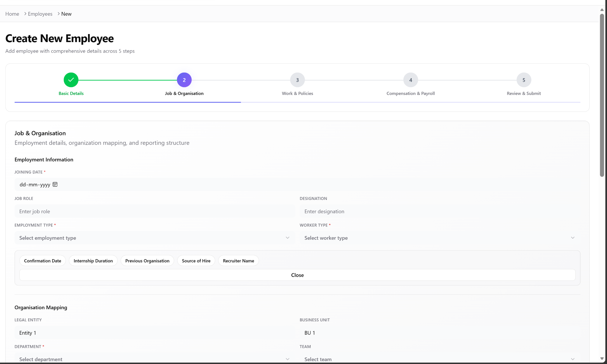

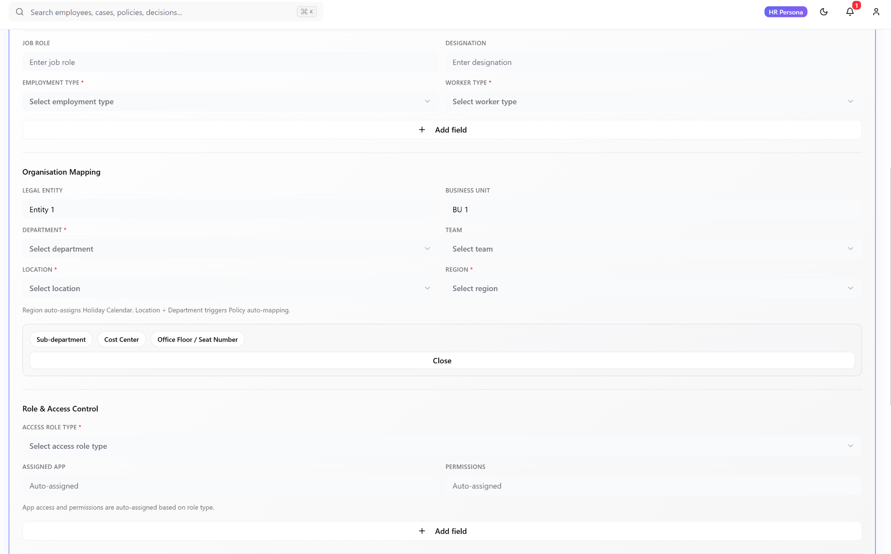

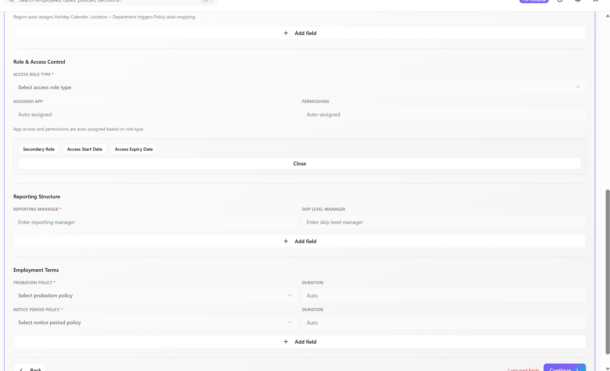

---

### Step 3: Work & Policies

### Steps

1. Configure onboarding settings.
2. Enable or disable **Invite Employee to Login**.
3. Enable or disable **Onboarding Workflow**.
4. Add onboarding-related fields if needed, such as buddy or mentor assigned, onboarding checklist template, IT setup required, or access card required.
5. Select leave policy, credit policy, and holiday calendar.
6. Enable attendance tracking if needed.
7. Select expense policy and related fields.
8. Click **Continue**.

### Screenshot

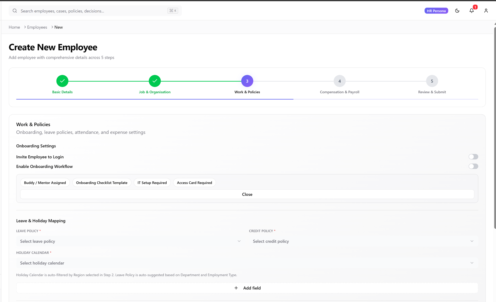

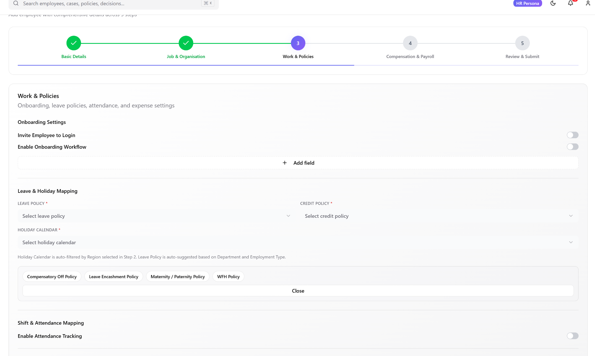

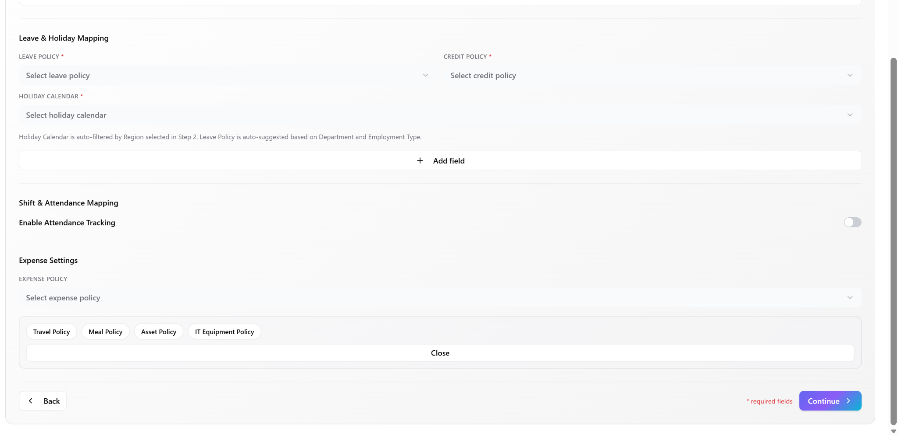

---

### Step 4: Compensation & Payroll

### Steps

1. Enable payroll if applicable.
2. Select payroll run type.
3. Select payment mode.
4. Enable salary hold if needed.
5. Select salary structure.
6. Enter fixed salary amount and annual CTC where required.
7. Add salary breakdown components.
8. Add bonus details if applicable.
9. Add perks and benefits if applicable.
10. Configure tax and compliance settings.
11. Click **Continue**.

### Screenshot

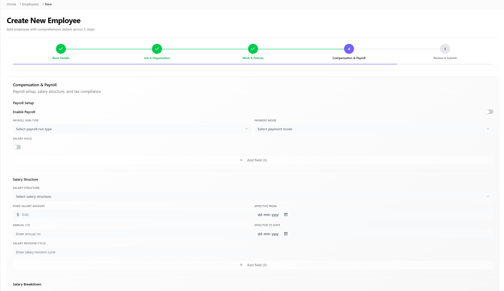

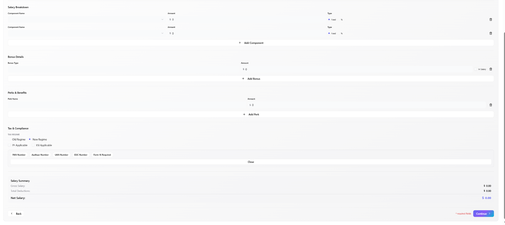

---

### Step 5: Review & Submit

### Steps

1. Review all employee information before submitting.
2. Check basic details and employment details.
3. Use **Back** if any correction is required.
4. Click **Save as Draft** to save without final submission.
5. Click **Submit & Create** to create the employee record.

### Screenshot

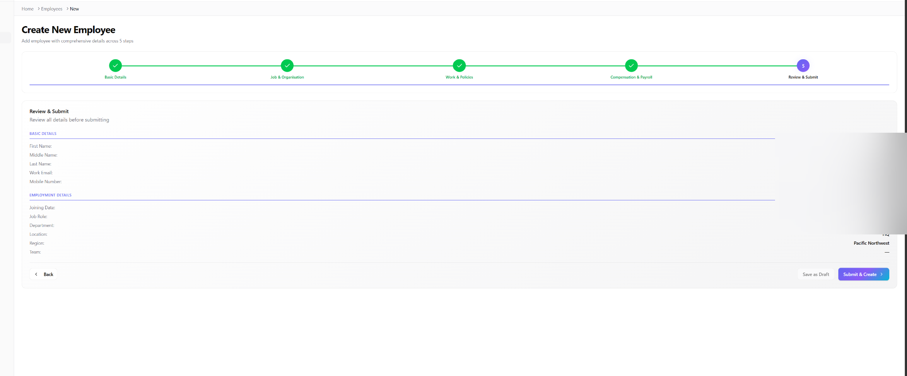

---

## 6. Policies & Compliance Module

### Purpose

The Policies & Compliance module allows authorized users to manage policy records and case template configurations.

### Access Path

1. Click **Policies & Compliance** from the left navigation menu.
2. Select either:
   - **Policy Repository**
   - **Case Repository**

---

### 6.1 Policy Repository

### Steps

1. Open **Policies & Compliance**.
2. Select **Policy Repository**.
3. Review the policy list.
4. Use search and filters to narrow results.
5. Use action icons to preview, edit, approve, reject, or view history based on permission.

### Policy Repository Columns

| Column | Description |
|---|---|
| Policy Name | Name of the policy. |
| Jurisdiction | Jurisdiction such as Company. |
| Category | Policy category. |
| Version | Version number. |
| Effective Date | Policy effective date. |
| Status | Draft, Initiated, Approved, Rejected, Archived, or related status. |
| Last Updated | Last updated time. |
| Actions | View, edit, history, and more actions. |

### Screenshot

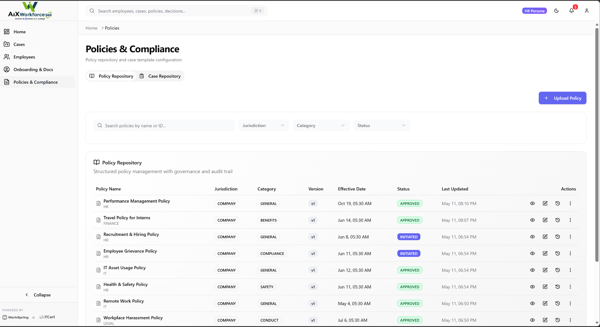

---

### 6.2 Search Policy

### Steps

1. Open **Policy Repository**.
2. Click the search field.
3. Enter policy name or policy ID.
4. Review filtered results.

### Screenshot

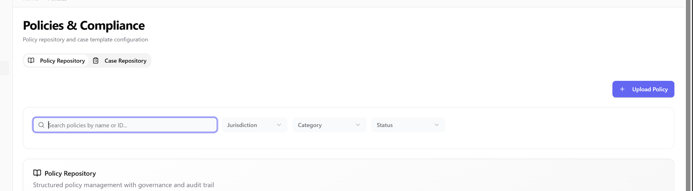

---

### 6.3 Filter Policy

### Steps

1. Open **Policy Repository**.
2. Select **Jurisdiction**, **Category**, or **Status** filter.
3. Choose a filter value.
4. Review updated policy results.
5. Select **Clear** to remove the filter.

### Screenshot

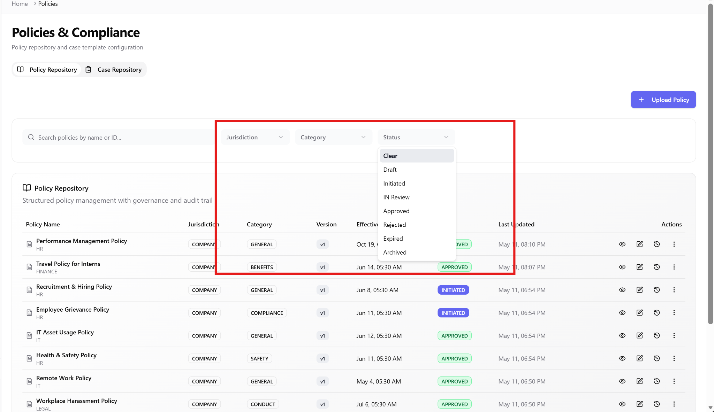

---

### 6.4 Upload Policy

### Steps

1. Open **Policy Repository**.
2. Click **Upload Policy**.
3. Enter policy title.
4. Select jurisdiction.
5. Select policy type.
6. Select policy category.
7. Enter policy version.
8. Select effective date and expiry date if required.
9. Select the employee group under **Applies To**.
10. Select confidentiality level.
11. Enter citation source if applicable.
12. Upload the policy document.
13. Click **Upload Policy**.

### Screenshot

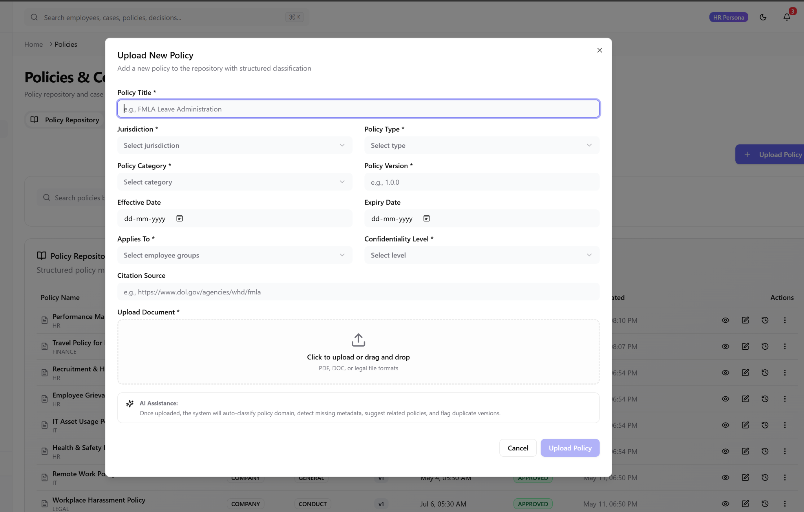

---

### 6.5 Edit Policy

### Steps

1. Open **Policy Repository**.
2. Locate the policy.
3. Click the edit icon.
4. Update policy details or upload a new document.
5. Click **Save Changes**.

### Screenshot

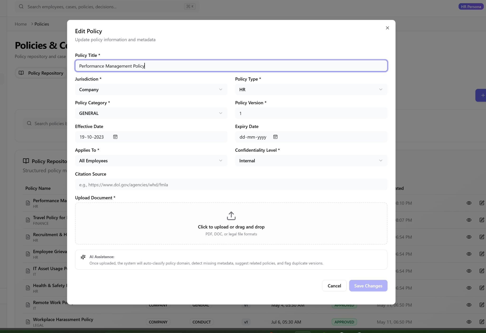

---

### 6.6 Preview and Download Policy

### Steps

1. Open **Policy Repository**.
2. Click the view icon for the required policy.
3. Review policy details in the preview popup.
4. Click **Download** if required.
5. Close the popup after review.

### Screenshot

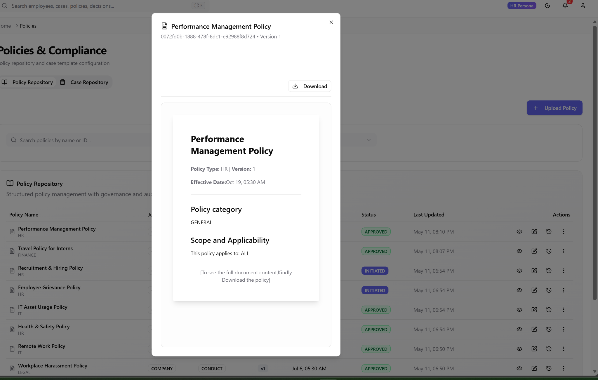

---

### 6.7 Approve or Reject Policy

### Steps

1. Locate a policy that is ready for action.
2. Click the three-dot action menu.
3. Select **Approve** or **Reject**.
4. The policy status updates based on the selected action.

### Screenshot

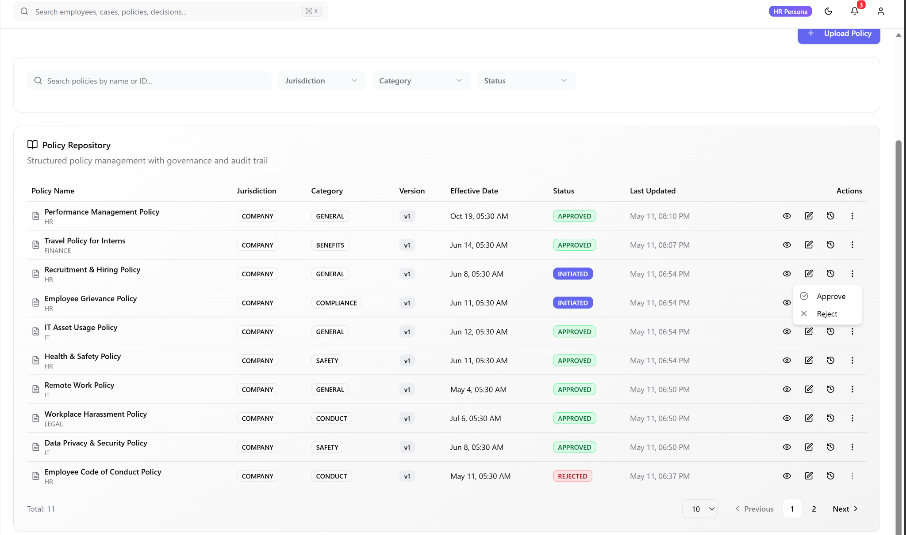

---

## 7. Case Repository / Case Configuration

### Purpose

The Case Repository is used to configure standardized case templates. These templates are used during case creation.

### 7.1 View Case Repository

### Steps

1. Open **Policies & Compliance**.
2. Select **Case Repository**.
3. Review existing case templates.
4. Check the primary role, secondary role, last updated time, and status.
5. Use action icons to preview, edit, or activate/deactivate a template.

### Screenshot

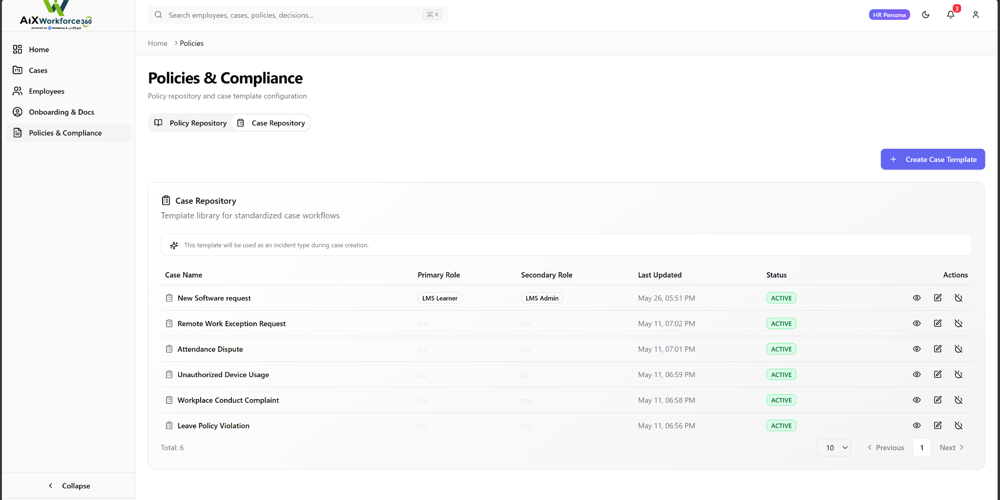

---

### 7.2 Create Case Template

The Create Case Template flow has five steps.

| Step | Name | Purpose |
|---|---|---|
| 1 | Basic Details | Add case name, description, and linked policies. |
| 2 | Resolution Actions | Define SOP or workflow steps. |
| 3 | Task Assignment | Assign primary, secondary, and escalation roles. |
| 4 | Communication | Configure communication templates and upload documents. |
| 5 | Review & Save | Review and publish or save as draft. |

---

### Step 1: Basic Details

### Steps

1. Click **Create Case Template**.
2. Enter **Case Name**.
3. Enter **Description**.
4. Select at least one linked policy.
5. Click **Next**.

### Screenshot

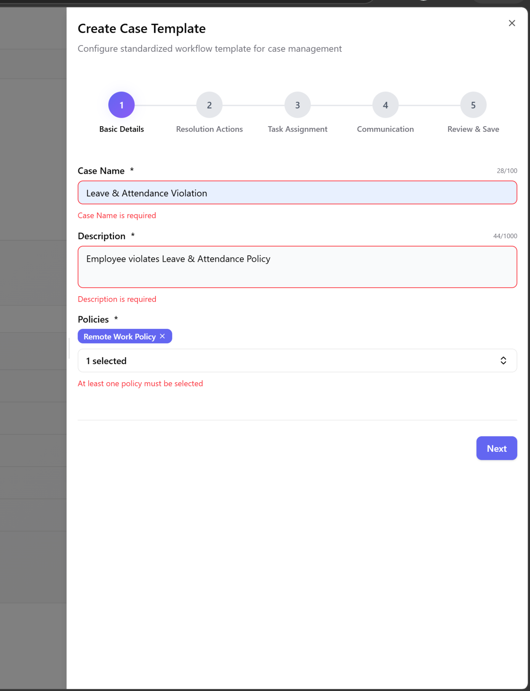

---

### Step 2: Resolution Actions

### Steps

1. Add an action title.
2. Add action description.
3. Mark the action as mandatory if needed.
4. Click **Add Action Step** to add more steps.
5. Reorder or delete steps if needed.
6. Click **Next**.

### Screenshot

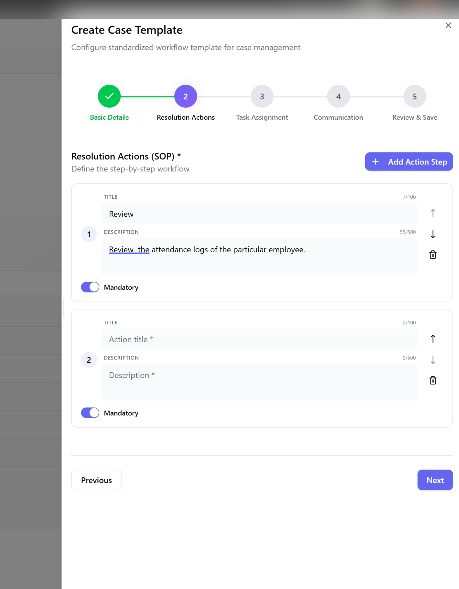

---

### Step 3: Task Assignment

### Steps

1. Select **Primary Role**.
2. Select **Secondary Role**.
3. Select **Escalation Role**, if applicable.
4. Click **Next**.

### Screenshot

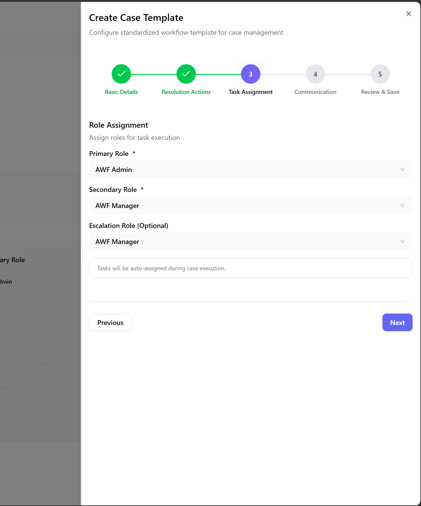

---

### Step 4: Communication Templates

### Steps

1. Enter template name.
2. Enter template description.
3. Upload a document if required.
4. Click **Add Template** to add another template.
5. Click **Next**.

### Screenshot

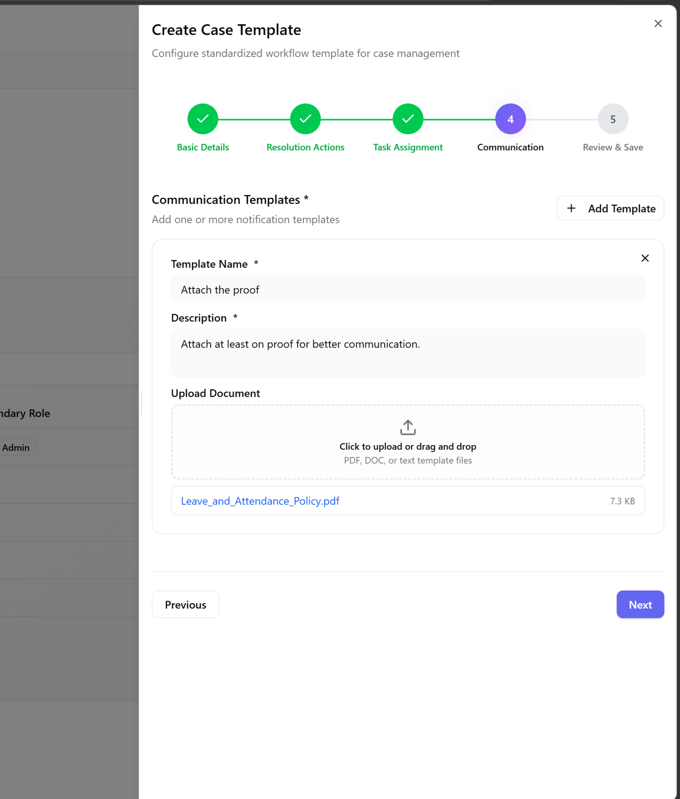

---

### Step 5: Review & Publish

### Steps

1. Review basic details.
2. Review resolution steps.
3. Review assigned roles.
4. Review communication templates.
5. Click **Save as Draft** to save without publishing.
6. Click **Publish Case Template** to make the template active.

### Screenshot

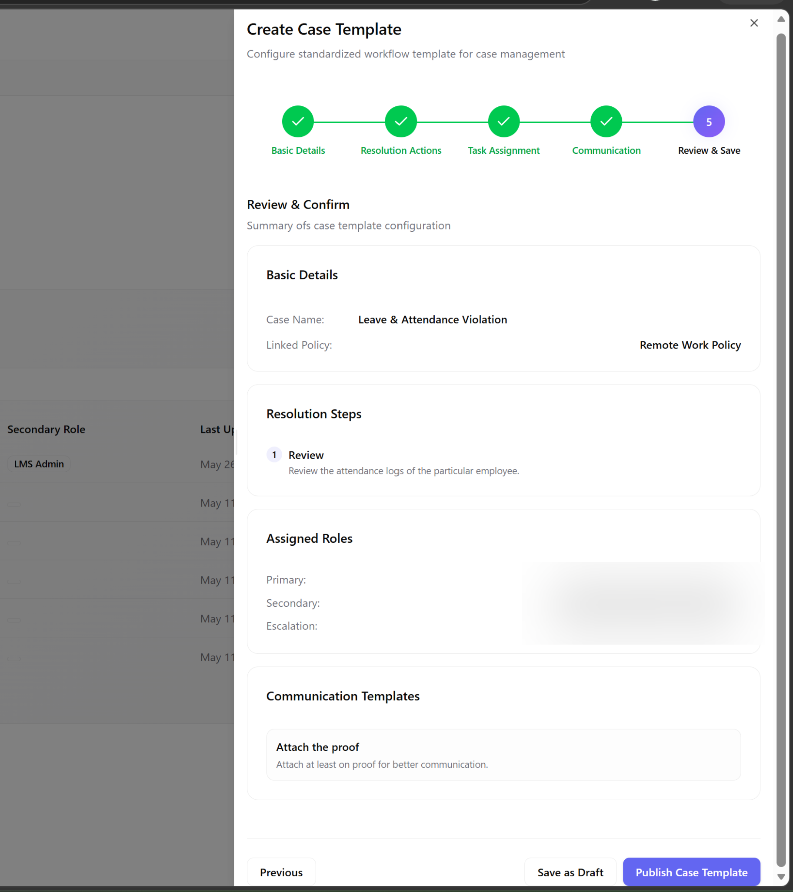

---

### 7.3 Preview Case Template

### Steps

1. Open **Case Repository**.
2. Click the preview icon.
3. Review basic details, SOP steps, assigned roles, and communication templates.
4. Close the preview panel after review.

### Screenshot

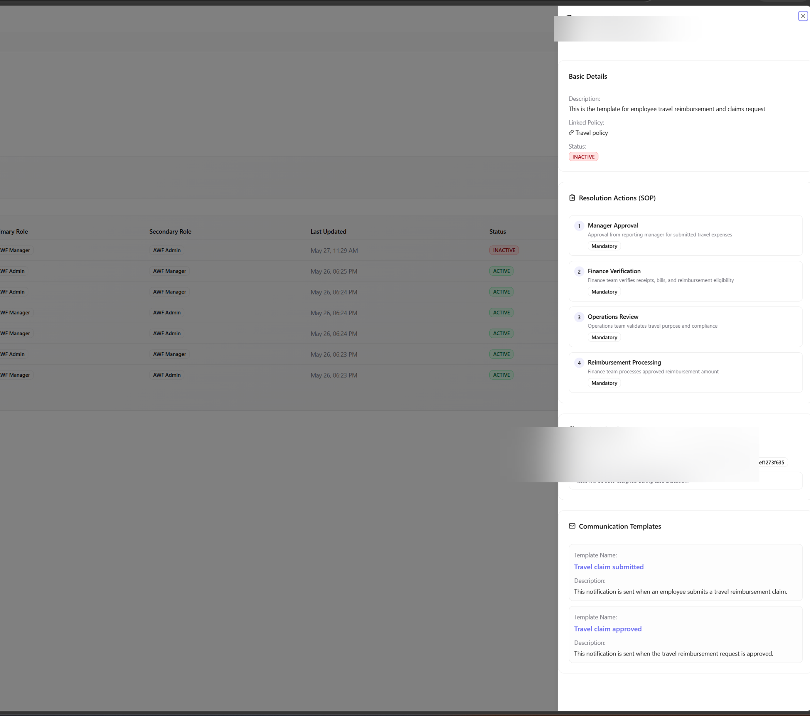

---

### 7.4 Edit Case Template

### Steps

1. Open **Case Repository**.
2. Click the edit icon.
3. Update required details across the same five-step wizard.
4. Save or publish the updated template.

### Screenshot

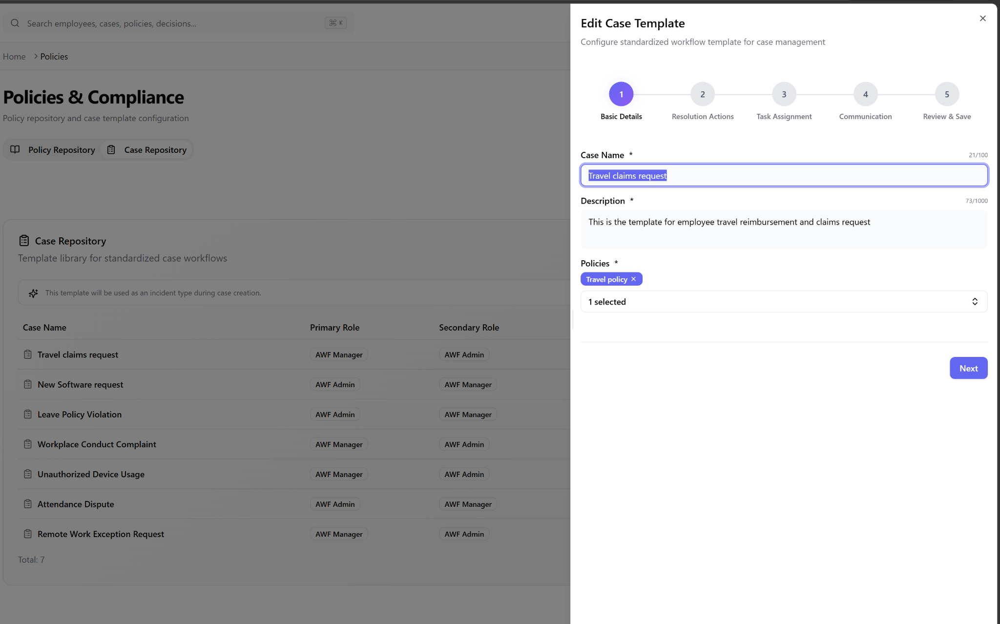

---

### 7.5 Activate or Deactivate Case Template

### Steps

1. Open **Case Repository**.
2. Locate the required template.
3. Use the active/inactive action from the action column.
4. Confirm the status change if prompted.

### Screenshot

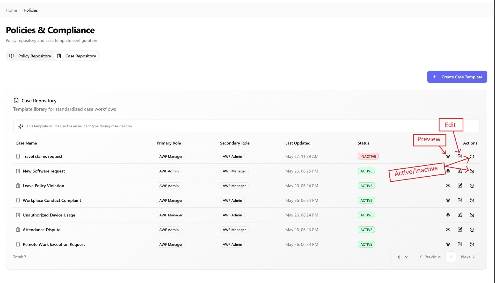

---

## 8. Case Management Module

### Purpose

The Case Management module allows users to create, track, review, and progress HR cases through an intelligence-supported workflow.

---

### 8.1 View Case Management List

### Steps

1. Click **Cases** from the left navigation menu.
2. The **Case Management** page opens.
3. Use the search bar to search cases by ID, title, or employee.
4. Use filters such as **Type**, **Status**, and **Priority**.
5. Review active cases in the table.
6. Click **View Case** to open a case.

### Screenshot

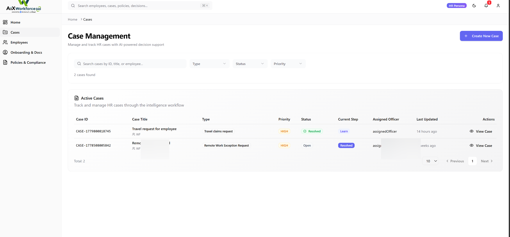

---

### 8.2 View Case Action

### Steps

1. Open the **Cases** module.
2. Locate the case in the active case list.
3. Click **View Case** under the Actions column.
4. The case details page opens.

### Screenshot

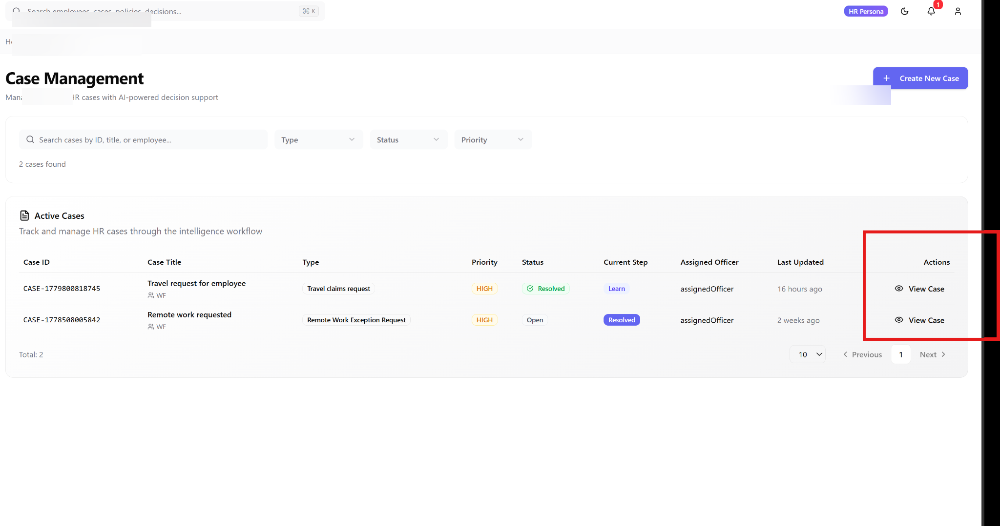

---

### 8.3 Create New Case

The Create New Case flow is a five-step wizard.

| Step | Name | Purpose |
|---|---|---|
| 1 | Case Details | Add incident information and description. |
| 2 | People | Identify complainant, accused, and involved parties. |
| 3 | Evidence | Upload files, documents, or media evidence. |
| 4 | Classification | Set jurisdiction, category, severity, priority, and SLA. |
| 5 | Review | Review the case and submit for processing. |

---

### Step 1: Case Details

### Steps

1. Open **Cases**.
2. Click **Create New Case**.
3. Enter case title.
4. Select case type.
5. Select incident date.
6. Enter location.
7. Enter description.
8. Click **Next: People**.

### Screenshot

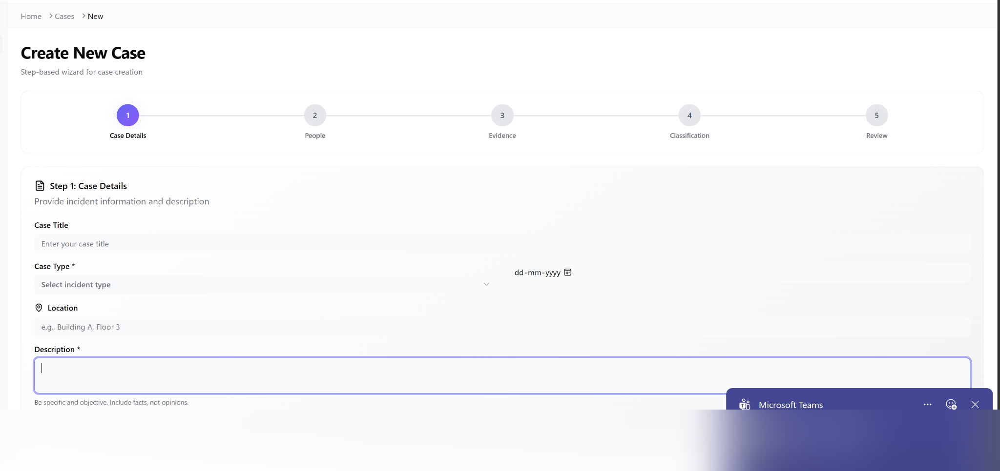

---

### Step 2: People Involved

### Steps

1. Select the person who requested or raised the case.
2. Select the employee or employees addressed in the case.
3. Select involved parties, if applicable.
4. Use multi-select if more than one person is involved.
5. Click **Next: Evidence Upload**.

### Screenshot

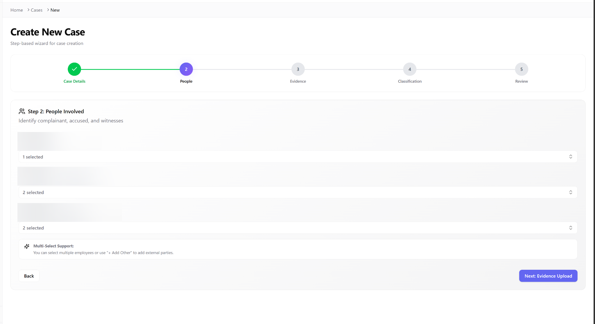

---

### Step 3: Evidence Upload

### Steps

1. Upload evidence files.
2. Supported file types may include PDF, DOC, images, and video files.
3. Use **View** to review an uploaded file.
4. Use **Remove** to delete an uploaded file before submission.
5. Review the AI assistance note.
6. Click **Next: Classification**.

### Screenshot

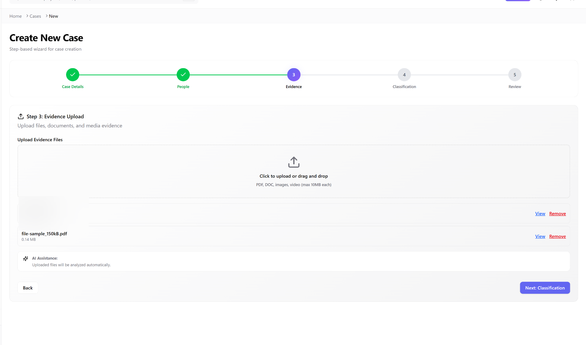

---

### Step 4: Classification

### Steps

1. Select jurisdiction.
2. Select category.
3. Select severity.
4. Select priority.
5. Select or confirm SLA timer.
6. Use **AI Suggest** if available.
7. Click **Next: Review & Submit**.

### Screenshot

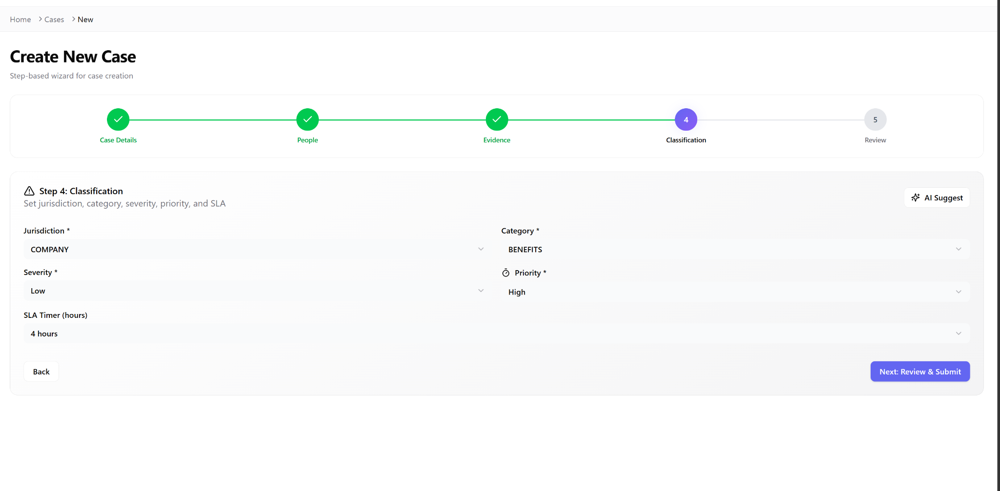

---

### Step 5: Review and Submit

### Steps

1. Review all case details.
2. Review complainant, accused, category, priority, severity, and SLA.
3. Review AI completeness check.
4. Select **Mark as Confidential** if the case should be restricted.
5. Click **Submit Case**.

### Screenshot

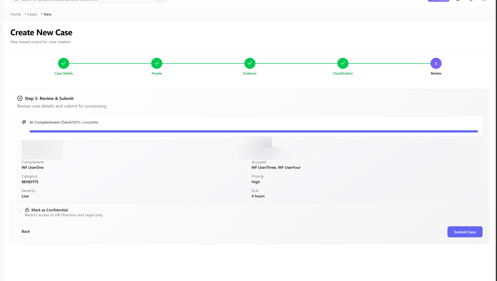

---

### 8.4 View Case Workflow

After opening a case, the user can move through or review the five workflow stages.

| Stage | Name | Purpose |
|---|---|---|
| 1 | Sense | Gather context and intelligence. |
| 2 | Decide | Analyze evidence and recommend next action. |
| 3 | Act | Execute and apply resolution steps. |
| 4 | Govern | Audit and validate decision quality. |
| 5 | Learn | Capture insights and feedback. |

---

### Stage 1: Sense

### What Users Can Review

- Case details and classification
- SLA timer
- People involved
- Evidence and attachments
- Initial signals and timeline
- Intelligence panel and AI recommendations

### User Steps

1. Open a case.
2. Review the case header.
3. Review case details and classification.
4. Review people involved.
5. Review evidence and attachments.
6. Click **Next: Decide**.

### Screenshot

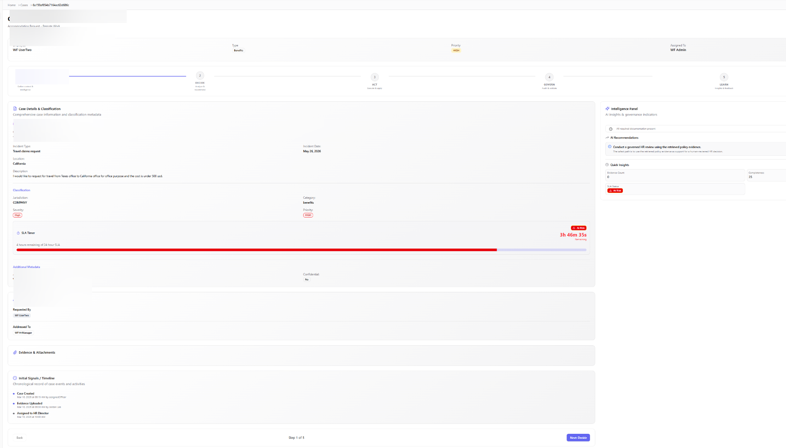

---

### Stage 2: Decide

### What Users Can Review

- Policy citations
- Risk indicators
- AI confidence
- AI recommendations
- Retrieved policy evidence

### User Steps

1. Open the case.
2. Move to the **Decide** stage.
3. Review policy citations.
4. Review risk indicators.
5. Review recommendations from the intelligence panel.
6. Click **Next: Act**.

### Screenshot

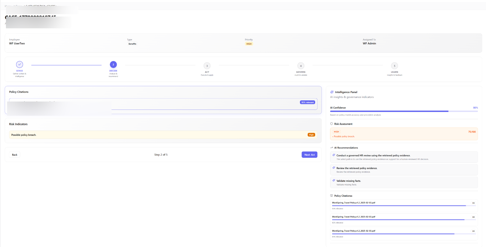

---

### Stage 3: Act

### What Users Can Review or Perform

- Resolution actions
- Task assignments
- Communication templates
- Decision approval options
- Escalation or document addition actions

### User Steps

1. Move to the **Act** stage.
2. Review loaded case template actions.
3. Review resolution action completion status.
4. Review assigned roles.
5. Review communication templates.
6. Approve, reject, escalate, or add document based on available permission.
7. Click **Next: Govern**.

### Screenshot

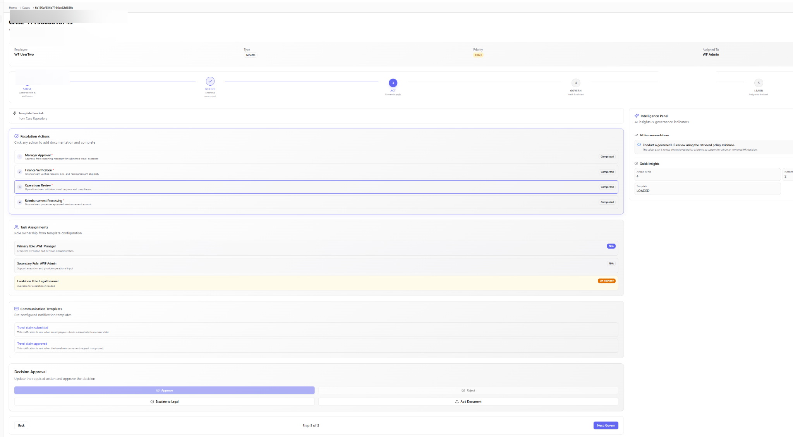

---

### Stage 4: Govern

### What Users Can Review

- Decision record
- Approval status
- SLA compliance timer
- Audit logs
- Data access and privacy information
- Intelligence panel recommendations

### User Steps

1. Move to the **Govern** stage.
2. Review decision record and approval status.
3. Review SLA compliance.
4. Review audit logs.
5. Review authorized viewers under data access and privacy.
6. Click **Next: Learn**.

### Screenshot

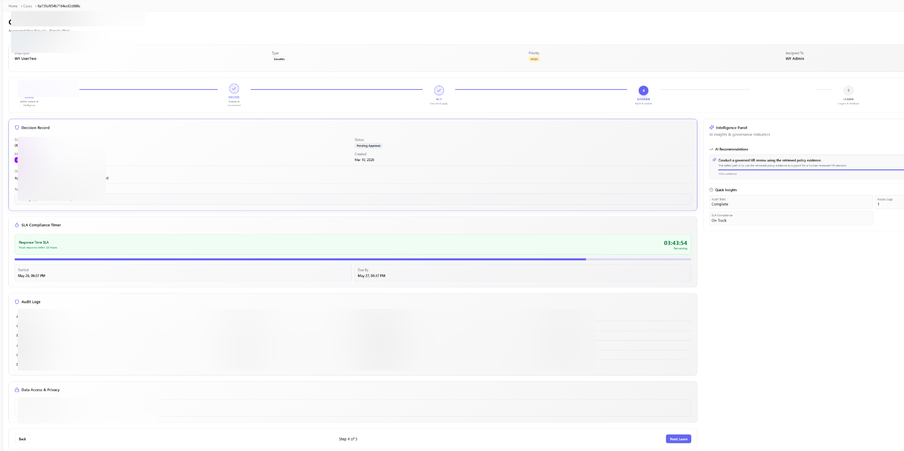

---

### Stage 5: Learn

### What Users Can Review

- Similar case insights
- Average resolution time
- Approval rate
- Appeal likelihood
- Delay patterns
- Documentation quality score
- Final intelligence panel indicators

### User Steps

1. Move to the **Learn** stage.
2. Review case insights.
3. Review delay patterns.
4. Review documentation quality score.
5. Click **Submit** to complete the stage where applicable.

### Screenshot

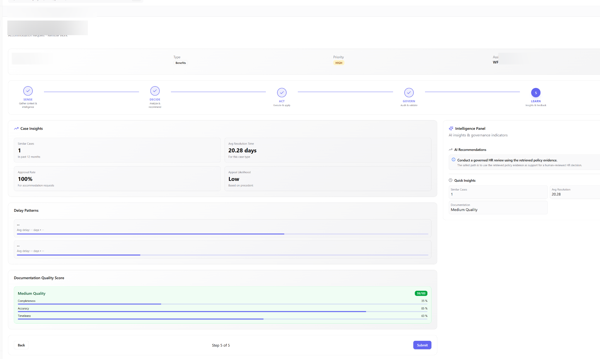

---

## 9. Onboarding & Docs Module

### Purpose

The Onboarding & Docs module helps users manage employee onboarding plans, monitor onboarding progress, and maintain checklist templates used for onboarding tasks and document collection.

The module typically has two working areas:

- **Onboarding Pipeline** for active onboarding records
- **Checklist Templates** for onboarding template creation and maintenance

---

### 9.1 Open the Onboarding & Docs Module

### Steps

1. Click **Onboarding & Docs** from the left navigation menu.
2. The module opens with summary cards and tab-based navigation.
3. Review the summary cards such as **Active Onboarding**, **Pending Tasks**, **Flagged Items**, and **Completed This Month**.
4. Use the top-right **Start Onboarding** button to create a new onboarding plan.
5. Use the tabs to switch between **Onboarding Pipeline** and **Checklist Templates**.

### Screenshot

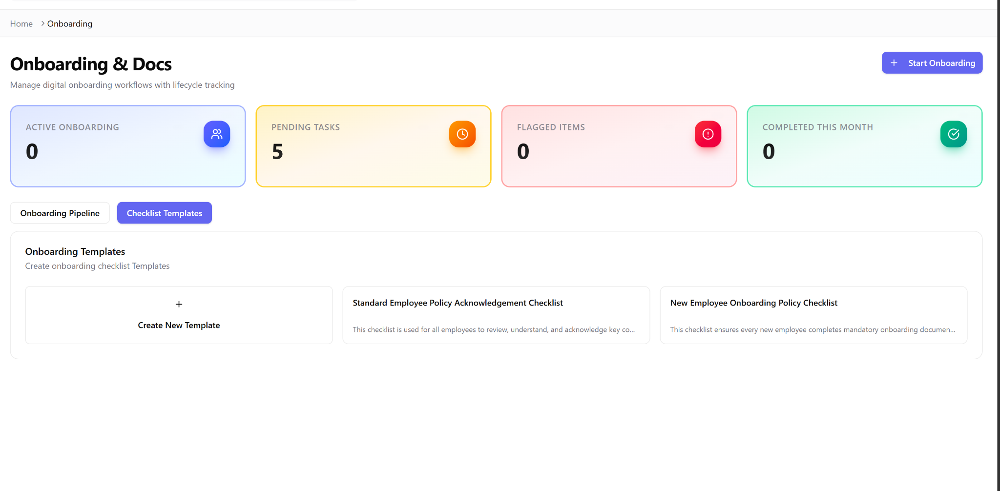

---

### 9.2 View the Onboarding Pipeline

### Purpose

The **Onboarding Pipeline** tab shows current onboarding records and helps users track progress.

### Steps

1. Open **Onboarding & Docs**.
2. Click the **Onboarding Pipeline** tab.
3. Use the search box to search by employee name or employee ID.
4. Review the onboarding list.
5. Check the visible columns such as employee name, employee ID, role, department, joining date, status, and progress.
6. Use this page to monitor how far each onboarding record has progressed.

### Screenshot

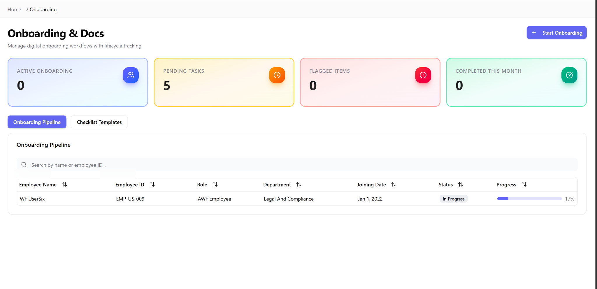

---

### 9.3 Start a New Onboarding Plan

### Purpose

The **Start Onboarding** flow allows the user to select an employee and create an onboarding plan.

### Steps to Open the Start Onboarding Popup

1. Open **Onboarding & Docs**.
2. Click **Start Onboarding**.
3. The **Start Onboarding** popup opens.
4. In the initial state, the user is prompted to select an employee.
5. If no employee is selected, the **Create Onboarding** button remains unavailable.

### Screenshot

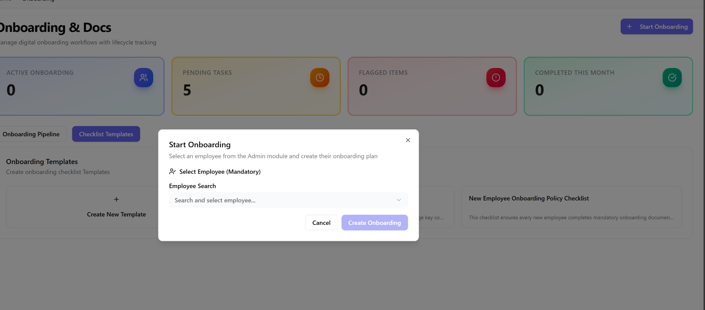

### Steps to Create the Onboarding Plan

1. In the **Start Onboarding** popup, use **Employee Search** to select an employee.
2. Review the displayed employee information such as personal details, employment details, and contact details.
3. In the **Create Onboarding Plan** section, select the checklist template.
4. Select the joining kit type, if applicable.
5. Select the HR owner or reviewer.
6. Select the due date.
7. Click **Create Onboarding**.

### Screenshot

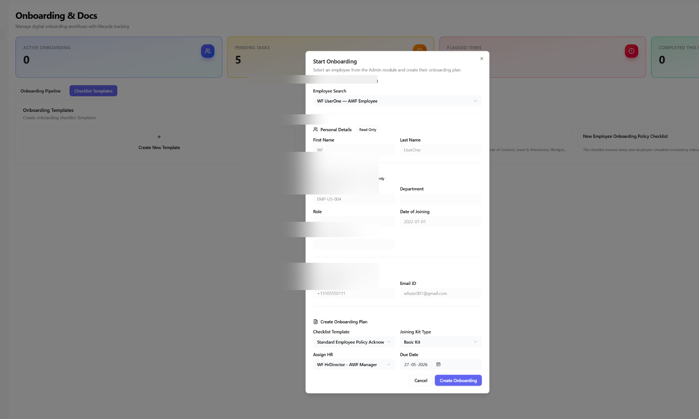

---

### 9.4 Open Checklist Templates

### Purpose

The **Checklist Templates** tab is used to create and manage onboarding templates.

### Steps

1. Open **Onboarding & Docs**.
2. Click **Checklist Templates**.
3. Review the available onboarding template cards.
4. Click **Create New Template** to add a new onboarding template.
5. Click an existing template card to open and manage that checklist.

### Screenshot

---

### 9.5 Open and Review a Checklist Template

### Purpose

Checklist templates organize onboarding work into lifecycle categories, sub-categories, and tasks.

### Steps

1. Open the **Checklist Templates** tab.
2. Select the required checklist template.
3. Review the checklist header and action buttons.
4. Review the visible lifecycle categories.
5. Expand a category to see its sub-category and assigned tasks.
6. Use **View Template** to review the template structure.
7. Use **Save Changes** after making updates.

### Screenshot

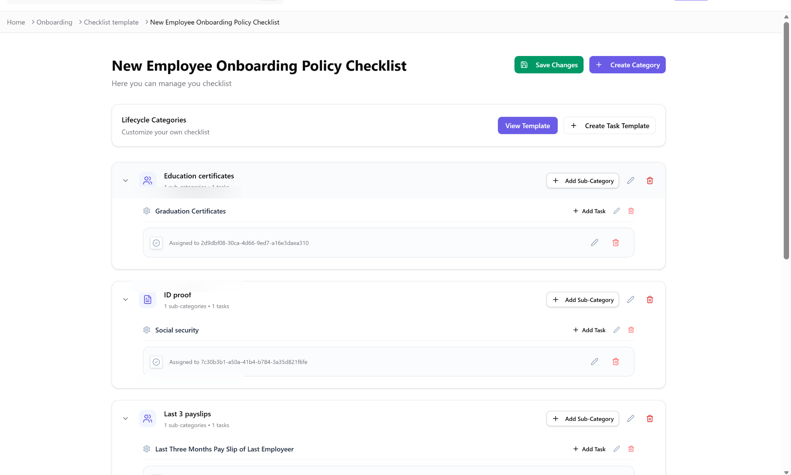

---

### 9.6 Create a New Category

### Steps

1. Open a checklist template.
2. Click **Create Category**.
3. Enter the category name.
4. Confirm the action to add the category.
5. The new category becomes available in the lifecycle category list.

> The category creation action is initiated from the **Create Category** button visible on the checklist template page.

### Screenshot

---

### 9.7 Add a Sub-Category

### Steps

1. Open the required checklist template.
2. Go to the category where the sub-category should be added.
3. Click **Add Sub-Category**.
4. Enter the sub-category name.
5. Click **Add**.
6. The new sub-category appears inside the selected category.

### Screenshot

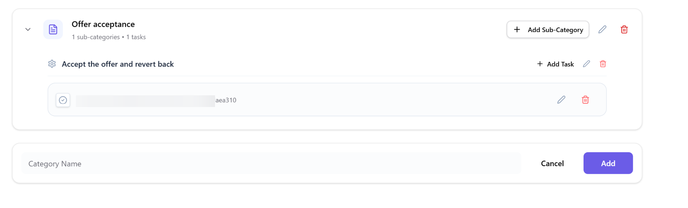

---

### 9.8 Create a Task Template

### Purpose

A task template defines the task title, description, type, supporting document, and status used in onboarding.

### Steps

1. Open the required checklist template.
2. Click **Create Task Template**.
3. Enter the **Task Title**.
4. Enter the **Description**.
5. Select the **Task Type**.
6. Upload a supporting document if needed.
7. Select the **Status**.
8. Click **Create**.

### Screenshot

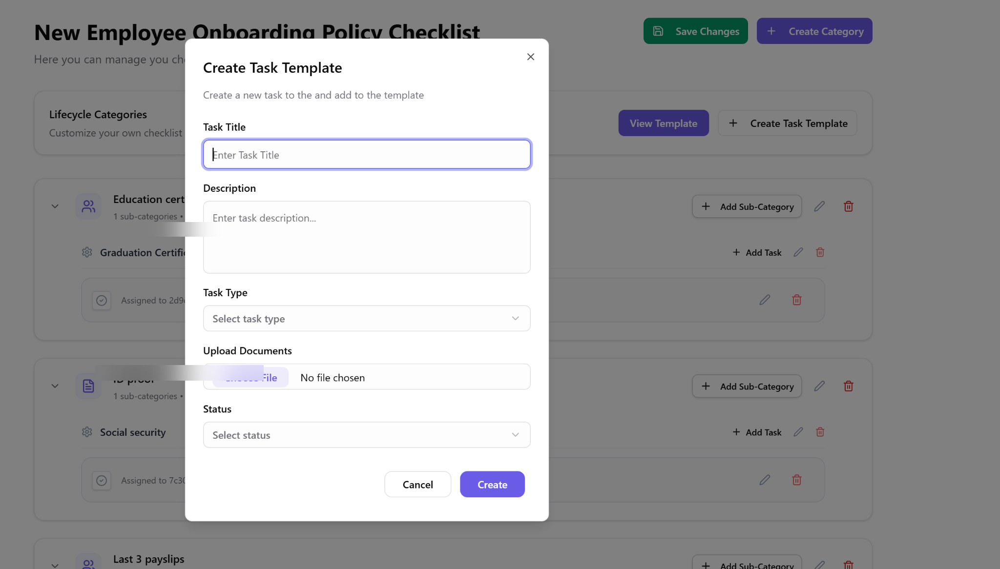

---

### 9.9 Search Task Templates

### Steps

1. Open the required checklist template.
2. Click **View Template** if task templates need to be reviewed.
3. Use the search box to search by task template name.
4. Review the search results.
5. If no template exists for the entered value, the page shows that no task templates were found.

### Screenshot

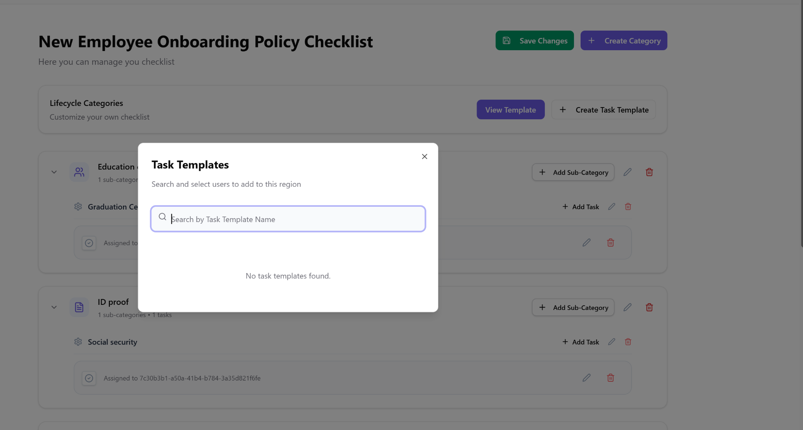

---

### 9.10 Add a Task Under a Sub-Category

### Steps

1. Open a checklist template.
2. Locate the required category and sub-category.
3. Click **Add Task**.
4. Select the task template.
5. Select the person to assign the task to.
6. Click **Next** or continue through the task assignment flow.
7. Save the task assignment.

### Screenshot

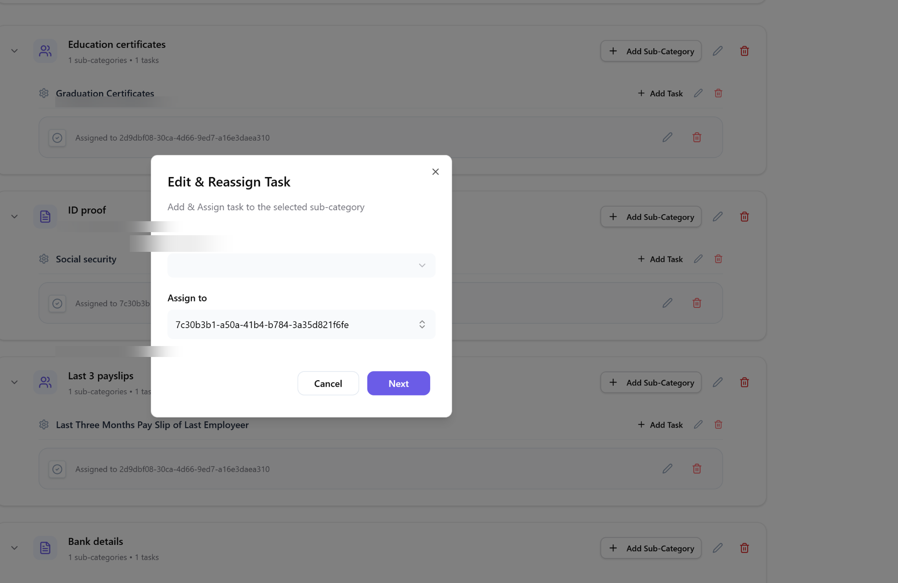

---

### 9.11 Edit or Reassign a Task

### Steps

1. Open the checklist template.
2. Locate the task that needs to be edited.
3. Click the edit icon for that task.
4. In the **Edit & Reassign Task** popup, review the selected task.
5. Change the assigned user if needed.
6. Continue using **Next** and complete the update.

### Screenshot

---

### 9.12 Save Checklist Template Changes

### Steps

1. After creating or updating categories, sub-categories, or tasks, review the checklist structure.
2. Click **Save Changes**.
3. Confirm that the changes are reflected in the checklist template.

### Screenshot

---

### 9.13 End-User Actions in Onboarding

From an end-user perspective, the most common onboarding actions are:

| User Action | Where It Happens | Result |
|---|---|---|
| Start onboarding for an employee | Start Onboarding popup | Creates a new onboarding plan |
| View onboarding progress | Onboarding Pipeline | Tracks employee onboarding status |
| Open checklist templates | Checklist Templates tab | Shows reusable onboarding structures |
| Create a new onboarding template | Checklist Templates tab | Creates a reusable checklist |
| Add category / sub-category | Checklist template detail | Organizes onboarding tasks |
| Create task template | Checklist template detail | Adds reusable task definitions |
| Add or assign task | Checklist template detail | Assigns onboarding work |
| Save changes | Checklist template detail | Stores template updates |

## 10. Permission-Based Visibility

AiXWorkforce360 uses permission-based visibility. This means a user may not see a module, button, or action if the required permission is not assigned.

| Scenario | Expected Behavior |
|---|---|
| User has employee create permission | Create Employee button is visible. |
| User does not have employee create permission | Create Employee button may be hidden. |
| User has case create permission | Create New Case button is visible. |
| User has policy upload permission | Upload Policy button is visible. |
| User has approve/reject permission | Approve and Reject actions are visible. |
| User has case template permission | Create Case Template and edit actions are visible. |
| Employee has onboarding task permission | Upload Document and Mark as Complete options are visible. |

---

## 11. Common User Tips

| Area | Tip |
|---|---|
| Login | Use the registered phone number linked to the user account. |
| OTP | Enter the latest OTP received. Use resend only if the timer allows. |
| Search | Use the search boxes to quickly find employees, policies, or cases. |
| Filters | Use filters when the list contains many records. |
| Required Fields | Fields marked with an asterisk must be completed before moving forward. |
| Uploads | Confirm file type and size before uploading documents or evidence. |
| Permissions | Contact the administrator if expected modules or buttons are missing. |
| Confidential Cases | Use the confidential option only when case access must be restricted. |
